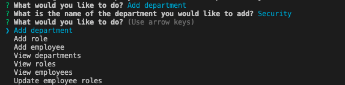
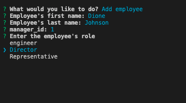
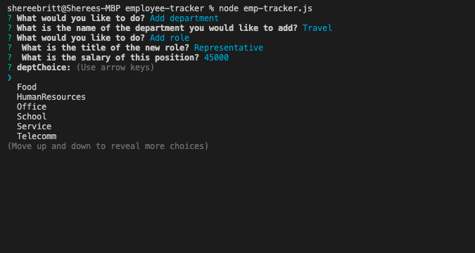
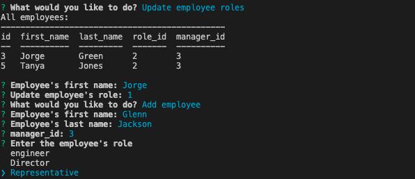
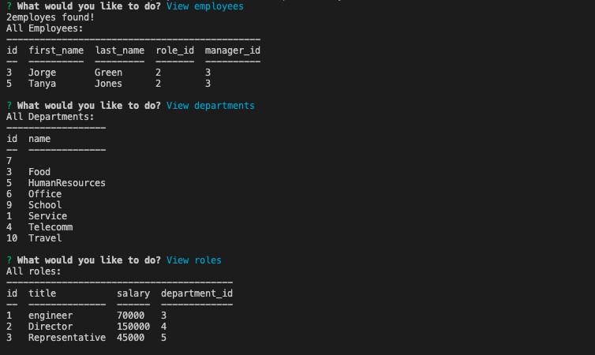

# Employee-tracker
Manage company employee tracker 

# Summary 

Developers are often tasked with creating interfaces that make it easy for non-developers to view and interact with information stored in databases. Often these interfaces are known as Content Management Systems. In this homework assignment, your challenge is to architect and build a solution for managing a company's employees using node, inquirer, and MySQL.

# Schema

# Technologies Used

MySql - NPM package to connect to MySQL database and perform queries.
InquirerJs - NPM package to interact with the user via the command-line.
Console.table - Print MySQL rows to the console. 

 
 
 
 
 
 